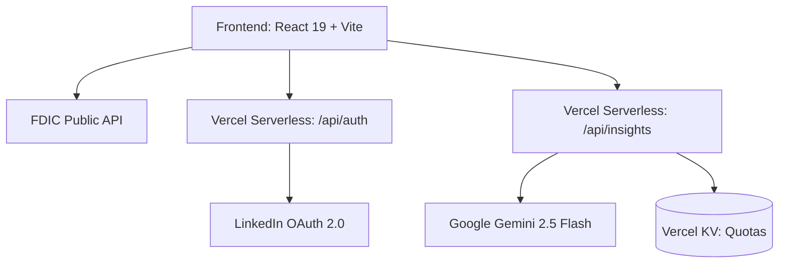

# Architecture & System Design

This document outlines the architecture, data flow, and technical decisions behind the Bank Value Benchmark application.

## 1. High-Level Architecture

The application follows a standard Single Page Application (SPA) architecture combined with a Serverless Backend for secure API integrations (AI and Authentication).



- **Frontend**: Handles all UI routing, state management, and direct data fetching for public data (FDIC API).
- **Serverless API**: Vercel serverless functions (`/api/*`) act as a proxy for operations requiring secrets (e.g., Gemini API keys, LinkedIn Client Secrets).
- **State Management**: React Context (`AuthContext`) manages global session state, while individual pages use local component state and Prop drilling.

## 2. Component Structure

The frontend is organized around feature modules and shared components:

```text
src/
├── App.jsx                  # Root App, Dashboard routing & layout
├── components/
│   ├── auth/                # Authentication Context and Modals
│   ├── BankSearch.jsx       # Initial search & FDIC integration
│   ├── FinancialDashboard.jsx # Core KPI dashboard
│   ├── StrategicPlannerTab.jsx # ML/Scenario planner UI
│   ├── PeerGroupModal.jsx   # Dynamic peer discovery
│   ├── SummaryModal.jsx     # AI Insight generation
│   ├── MoversView.jsx       # Market movers radar
│   └── USMap.jsx            # Geographic viz
├── services/
│   └── fdicService.js       # Client wrapper for data.fdic.gov API
└── utils/
    ├── kpiCalculator.js     # Shared financial logic/formulas
    └── stateMapping.js      # Geo-spatial references
```

## 3. Data Pipelines

### A. Real-time Financial Data (FDIC)
We do not cache or store financial data in a local database. 
1. The app queries the FDIC `institutions` and `financials` endpoints directly from the client.
2. It fetches 16 quarters of Call Report data dynamically based on the selected target bank's CERT ID.
3. Call report values (which are given in thousands, $000s) are converted and piped through `kpiCalculator.js` to compute ratios like ROA, ROE, Net Interest Margin, and Efficiency Ratio.

### B. Dynamic Benchmarking
1. Based on the target bank's asset size and geographic location, the app automatically fetches up to 500 potential peer banks.
2. It sorts them by proximity (using `stateMapping.js` and Geo-location estimations).
3. The top 20 nearest peers in the exact asset tier are used to calculate 25th percentile (P25), Median, and 75th percentile (P75) benchmarks.

## 4. API & Security Layer

- **Authentication**: Users must log in via LinkedIn to access AI features. The flow uses an Authorization Code OAuth 2.0 flow. Local storage (`auth_state`) mitigates CSRF.
- **Rate Limiting**: AI features are costly. We use **Vercel KV** (a serverless Redis store) to implement daily connection quotas per `linkedin_sub` ID. Exceeding the quota returns a `429 Too Many Requests`.
- **Fail Loudly Strategy**: Environment variables or connection errors must prominently display UI alerts rather than failing silently.
