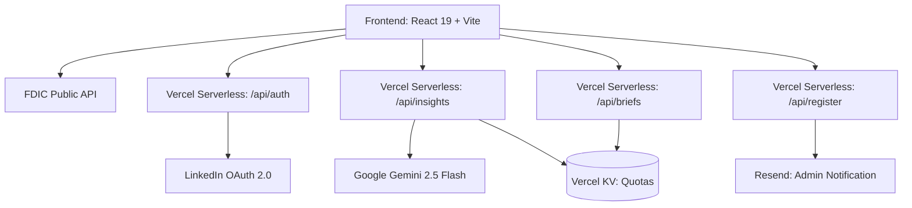

# Architecture & System Design

This document outlines the architecture, data flow, and technical decisions behind the Bank Value Benchmark application.

## 1. High-Level Architecture

The application follows a standard Single Page Application (SPA) architecture combined with a Serverless Backend for secure API integrations (AI, Authentication, and Brief Storage).



- **Frontend**: Handles all UI routing, state management, and direct data fetching for public data (FDIC API).
- **Serverless API**: Vercel serverless functions (`/api/*`) act as a proxy for operations requiring secrets (Gemini API keys, LinkedIn Client Secrets) and for Vercel KV operations.
- **State Management**: React Context (`AuthContext`) manages global session state; individual components use local state and prop drilling.

## 2. Component Structure

```text
src/
├── App.jsx                         # Root App, bank selection flow & layout
├── components/
│   ├── auth/
│   │   ├── AuthContext.jsx         # LinkedIn OAuth session management
│   │   └── LoginModal.jsx          # Sign-in UI
│   ├── pdf/                        # react-to-print PDF export pipeline
│   │   ├── PrintContainer.jsx      # Off-screen multi-slide container
│   │   ├── Slide1_CoreMetrics.jsx
│   │   ├── Slide2_Returns.jsx
│   │   ├── Slide3_ExecutiveSummary.jsx
│   │   └── Slide4_PeerGroup.jsx
│   ├── BankSearch.jsx              # FDIC institution search
│   ├── FinancialDashboard.jsx      # Core KPI dashboard + controls
│   ├── FinancialDashboardSkeleton.jsx  # Loading placeholder
│   ├── GaugeChart.jsx              # Recharts semi-circle gauge with quartile bands
│   ├── LandingPage.jsx             # Pre-search entry gate
│   ├── MoversSummaryModal.jsx      # Competitive intel modal + Save Brief
│   ├── MoversView.jsx              # Movers table/scatter (standalone + pitchbook)
│   ├── OperationalDashboard.jsx    # Give-to-Get operational benchmarks
│   ├── PeerGroupModal.jsx          # Peer group list + USMap
│   ├── PitchbookPresentation.jsx   # 5-slide full-screen IB presentation
│   ├── SavedBriefsModal.jsx        # My Briefs modal (list + delete)
│   ├── Sparkline.jsx               # Inline sparkline bar component
│   ├── StrategicPlannerTab.jsx     # ML-based scenario/what-if planner
│   ├── SummaryModal.jsx            # AI financial summary + export actions
│   ├── Tooltip.jsx                 # Shared tooltip wrapper
│   ├── TrendIndicator.jsx          # QoQ arrow + % change badge
│   ├── TrendSparkline.jsx          # Hover-activated mini line chart
│   ├── UserProfileMenu.jsx         # Avatar, Saved Briefs, Logout
│   └── USMap.jsx                   # SVG tile-grid US map
├── services/
│   └── fdicService.js              # Client wrapper for data.fdic.gov
└── utils/
    ├── exportHtmlBrief.js          # Self-contained HTML brief generator
    ├── kpiCalculator.js            # Shared financial KPI formulas
    └── stateMapping.js             # Geo-spatial US state adjacency
```

## 3. Data Pipelines

### A. Real-time Financial Data (FDIC)
Data is never cached on the server — fetched fresh client-side on each bank selection.
1. The app queries `institutions` and `financials` FDIC endpoints directly from the browser.
2. Fetches 16 quarters of Call Report data for the selected bank's CERT ID.
3. Call report values (denominated in $000s) are piped through `kpiCalculator.js` to compute ratios: ROA, ROE, NIM, Efficiency Ratio, and 6 others.

### B. Dynamic Benchmarking
1. Based on target bank's asset size and geographic location, fetches up to 500 candidate peer banks.
2. Sorts by proximity using `stateMapping.js` (same-state → neighboring states → national).
3. Top 20 nearest peers in the exact asset tier compute P25, Median, and P75 benchmarks.

### C. AI Generation Pipeline
1. User triggers AI summary from `SummaryModal` or competitive brief from `MoversSummaryModal`.
2. Frontend sends structured financial + benchmark data to `POST /api/insights`.
3. `/api/insights` checks daily quota in Vercel KV. If quota exceeded → `429`.
4. On success, stores usage in KV and proxies to Gemini, returning the `text` response.
5. Frontend renders the response and offers Copy | Export HTML | Save Brief actions.

### D. PDF Export Pipeline
1. `PrintContainer` is mounted off-screen in `App.jsx` with 4 child slides.
2. On "Export PDF" click, `useReactToPrint` triggers browser print dialog scoped to the container.
3. Each slide uses fixed `1100×619px` page-break-separated CSS for consistent print output.

### E. Saved Briefs Pipeline
1. `POST /api/briefs` — saves a brief record to `briefs:<sub>` Redis hash in Vercel KV.
2. `GET /api/briefs` — retrieves all briefs for the user, sorted newest-first.
3. `DELETE /api/briefs` — removes a specific record by `briefId`.

## 4. API & Security Layer

- **Authentication**: LinkedIn OAuth 2.0 Authorization Code Flow. Session stored in `localStorage`. CSRF mitigated via `state` nonce.
- **Rate Limiting**: Daily AI quota per `linkedin_sub` enforced in `api/insights.js` via Vercel KV. Admin subs bypass.
- **Fail Loudly Strategy**: Environment variable errors, API connection failures, and quota violations all surface as UI alerts (red toast/banner), never silently fail.
- **Local Dev Bypass**: When `VITE_GEMINI_API_KEY` is set and `authRequired = false`, AI calls go directly from the browser using the Gemini SDK (no auth needed for local testing).
